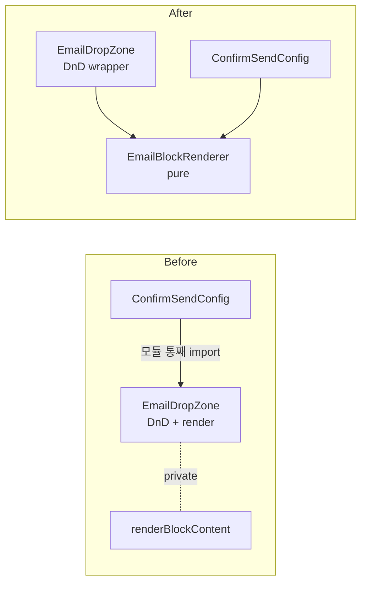

# 개선 제안 — `renderBlockContent` 위치/결합도

| 항목 | 내용 |
|------|------|
| **대상** | [`src/features/nodes/email-create/ui/EmailDropZone.tsx`](../src/features/nodes/email-create/ui/EmailDropZone.tsx) 의 `renderBlockContent` (L24) |
| **Why** | 12종 블록을 그리는 **순수 함수**가 DnD-kit 의존성이 높은 컴포넌트 파일 안에 비공개로 갇혀 있음. 미리보기에서 재사용하려면 export 또는 컴포넌트 추출이 강제됨. |
| **How** | `ui/EmailBlockRenderer.tsx` 로 분리. 편집 화면은 그 컴포넌트를 `SortableBlock` 으로 wrap, 미리보기는 직접 사용. |
| **기대 효과** | 미리보기 페이지에 DnD-kit 번들 안 끌림 · 블록 단위 테스트 가능 · 새 표시 위치(사이드바·공유 페이지 등) 추가 비용 거의 없음. |

---

---

## 구조 비교



```tsx
// ui/EmailBlockRenderer.tsx (신규, pure)
export function EmailBlockRenderer({ block, brandColor }: Props) {
  switch (block.type) {
    case 'Text':   return <TextView block={block} brandColor={brandColor} />
    case 'Button': return <ButtonView block={block} brandColor={brandColor} />
    // ... 12종 ...
    default: { const _x: never = block; return null }   // exhaustive check
  }
}
```


